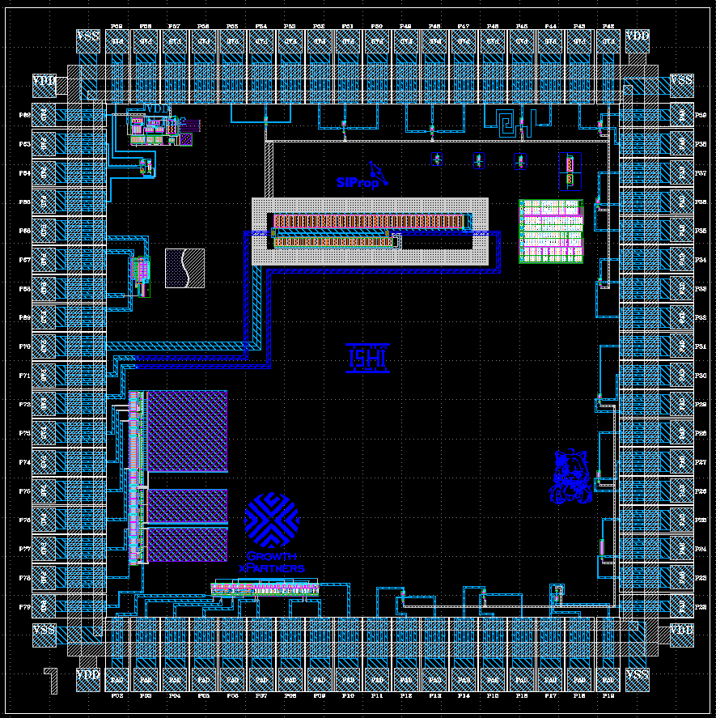
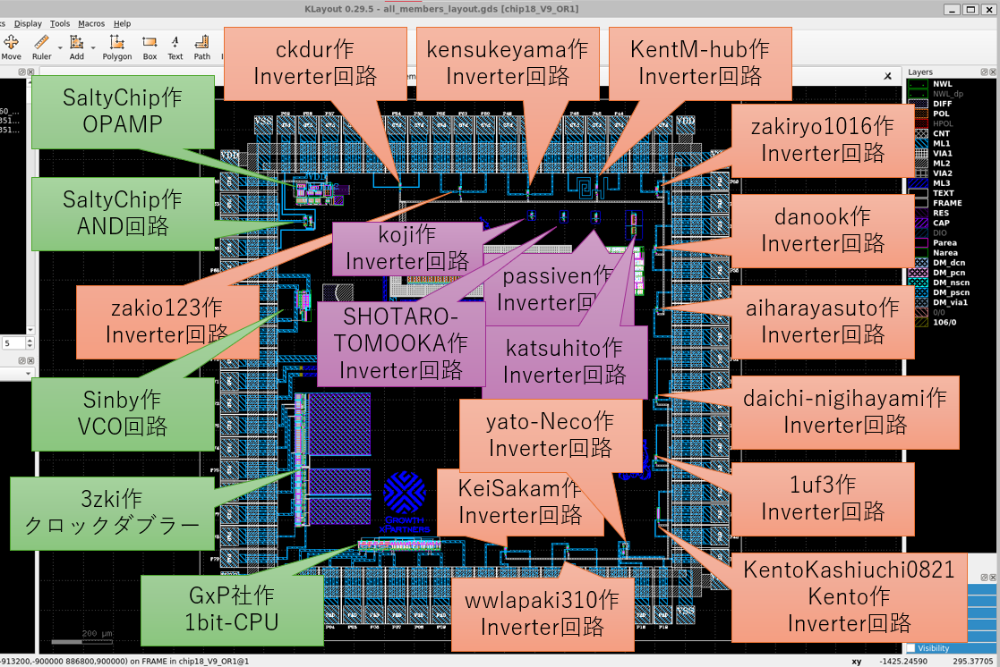
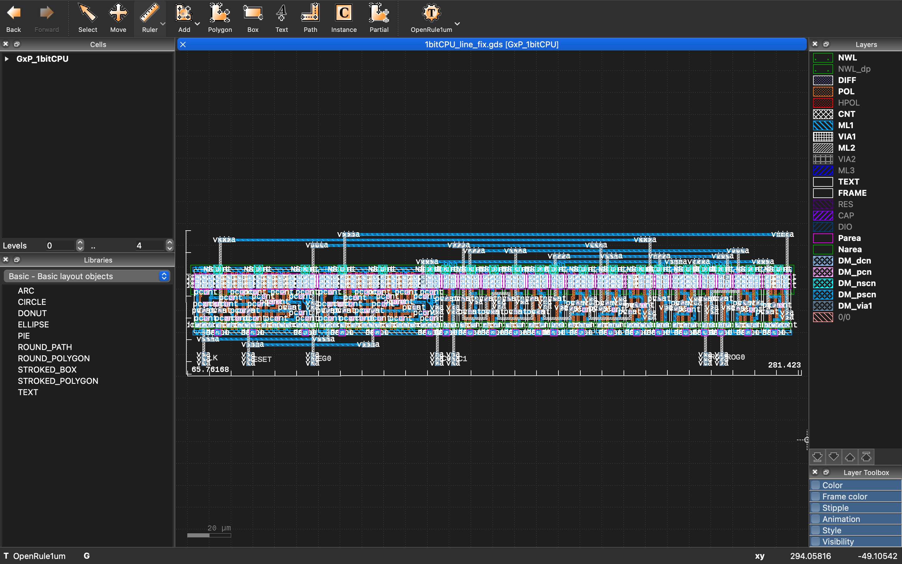
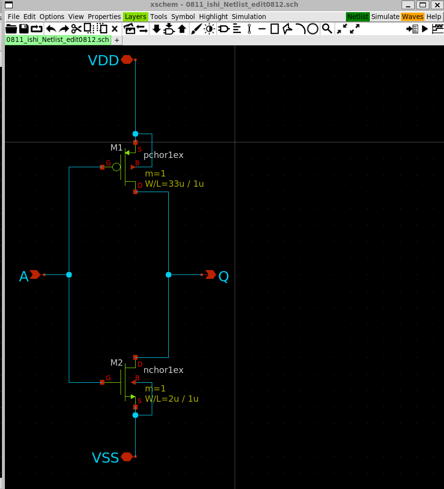
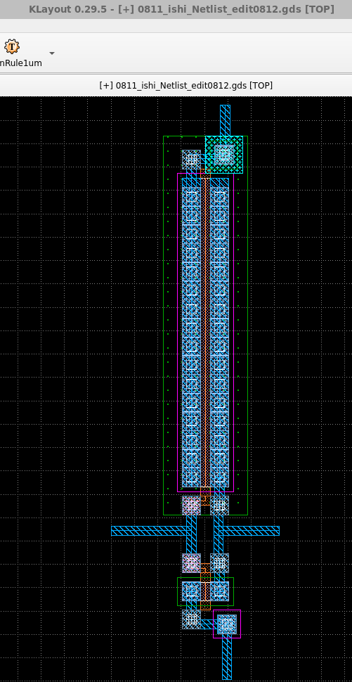
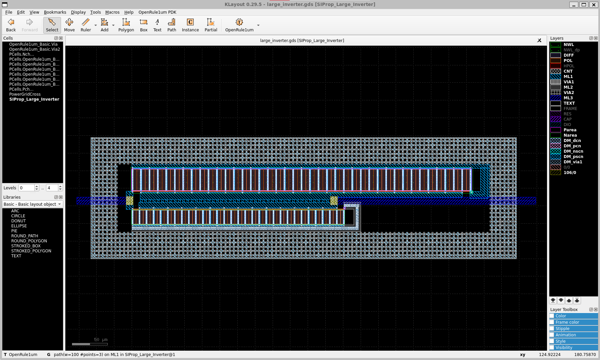

# ISHI会版OpenMPW PTC06-1について
これは、[ISHI会版OpenMPW PTC06-1](https://ishi-kai.org/openmpw/shuttle/ptc06/2024/07/06/shuttle_ISHI-Kai_OpenMPW-PTC06-1_start.html)にみんなで相乗りしたxschemによる回路図とklayoutによるレイアアウト置き場です。

## みんなの[相乗りチップ](Submitted/all_members_layout.gds)
- 
- 

-- 緑枠
--- 独自設計の回路
-- オレンジ枠
--- 初めてのInverter回路
-- 紫枠
--- 初めてのInverter回路だけどピン不足によりレイアアウト配置のみ

# 参加者リスト
- [GxP](https://www.gxp.co.jp)
- [3zki](https://github.com/3zki)
- [Sinby](https://sinby.com)
- [SIProp](https://www.siprop.org)
- [SaltyChip](https://github.com/SaltyChip703)
- [KeiSakam](https://github.com/KeiSakam/240811_Ishikai_Inverter_seminar)
- [wwlapaki310](https://github.com/wwlapaki310/OpenMPW_Ishi-kai_20240811)
- [yato-Neco](https://github.com/yato-Neco/ISHI-8-11/)
- [KentoKashiuchi0821Kento](https://github.com/KentoKashiuchi0821Kento/240811_Ishi_Inverter)
- [1uf3](https://github.com/1uf3/Inverter)
- [aiharayasuto](https://github.com/aiharayasuto/Ishikai_analog-design_2024-08/)
- [danook](https://github.com/danook/my-first-semicon)
- [zakiryo1016](https://github.com/zakiryo1016/20240811_ishikai)
- [KentM-hub](https://github.com/KentM-hub/Circuit)
- [kensukeyama](https://github.com/kensukeyama/OpenMPW)
- [daichi-nigihayami](https://github.com/daichi-nigihayami/inverter)
- [zakio123](https://github.com/zakio123/nandchip)
- [ckdur](https://github.com/ckdur/inv_orule1um)
- [passiven](https://github.com/passiven/ishi-kai_seminar)
- [katsuhito](https://github.com/kensukeyama/OpenMPW/katsuhito)
- [koji](https://github.com/kensukeyama/OpenMPW/koji/)
- [SHOTARO-TOMOOKA](https://github.com/SHOTARO-TOMOOKA/Chibasho)

## 各種リスト
- [メンバーリスト](docs/member_list.pdf)
- [ピンリスト](docs/pin_list.pdf)

# 参加者のデザイン
## [GxP](member_project/GxP/)：1bit CPU made with ASIC (ISHI-Kai's OpenMPW PTC06-1)
「こんなものわざわざASIC化しちゃったの？技術の無駄遣い！」というコンセプトの元、[naoto64氏の1bit-CPU](https://naoto64.github.io/1bit-CPU/)を[ISHI会版OpenMPW PTC06-1](https://ishi-kai.org/openmpw/shuttle/ptc06/2024/07/06/shuttle_ISHI-Kai_OpenMPW-PTC06-1_start.html)を利用して、ASIC化しました！  
サイズは、280um x 65um くらいとなりました。元の基板が85mm x 70mmですのでおよそ36万分の1に縮小できました！  

- 
- 
- 

## [3zki](member_project/3zki/)
（フェニテックのPDKを利用したガチ設計のため、非公開）

## [Sinby](member_project/Sinby/): リングオシレータ VCO 
### 設計したもの
リングオシレータ VCO を作りました。
出力にバッファをつけてあります。
- 
- 
- 
- 

### 感想
レイアウトはもう少し一般的な工夫をすれば小さくなると思います。

## [SaltyChip703](member_project/SaltyChip703/AND_circuit/)：AND回路
### 設計したもの
NANDとインバータをつないでAND回路になっています．
NANDはスタセルを使わずに手動でレイアウトをしました．
後段のインバータはスタセルです．
シミュレーションで閾値が電源電圧の半分ぐらいになるように調整しました．
動くことを祈っています．

- 
- 

### 感想
なかなかDRCとLVSが通らず苦労しました．

## [SaltyChip703](member_project/SaltyChip703/Op-amp1/)： オペアンプ
### 設計したもの
2段差動アンプを作りました．

- 
- 

### 感想
あまり工夫を盛り込むことができなかったので、もっと技術力をつけて、高度なものをつくっていきたいです！

## [KeiSakam](https://github.com/KeiSakam/240811_Ishikai_Inverter_seminar)：Inverter回路
### 感想
普段ソフトウェアエンジニアとして仕事をする中で、最近低レイヤーへの興味が湧いてきたことをきっかけに参加させていただきました。

半導体の知識が全くない状態から CMOS インバータ回路の設計とレイアウトを DRC と LVS も含めて半日で体験でき、非常に濃くて有意義な時間でした！！

最初から最後まで付きっきりでサポートしてくださった Rapidus の𠮷富さんをはじめ、運営に携わってくださった皆様、本当にありがとうございました。 (自分だけで時給換算いくら消費したのかわかりません)

半導体の世界に一歩踏み出せた今日の体験をきっかけに、必ずもっと学んで次はサポートする側に回ったり、今より低レイヤーの仕事に就いたりするなどして、微力ながらでも日本の半導体業界を盛り上げていくことに活かしていきたいです！

- 
- 

## [wwlapaki310](https://github.com/wwlapaki310/OpenMPW_Ishi-kai_20240811)：Inverter回路
### 感想
普段はクラウドやAIなど上位層の技術ばかりを触っていたこともあり、初めての半導体設計で主にツールの使い方把握に苦労しましたが、温かいサポートと同じ参加者との交流のおかげで、低レイヤーの知識も身に付き大変楽しかったです。

開催ありがとうございました！

- 
- 

## [yato-Neco](https://github.com/yato-Neco/ISHI-8-11/)：Inverter回路
### 感想
自分はソフトのレイヤーしか触った事がなく、今回興味があり半導体を作ることにチャレンジをしたのですが、思ったより難しかったです。

- 
- 

## [KentoKashiuchi0821Kento](https://github.com/KentoKashiuchi0821Kento/240811_Ishi_Inverter)：Inverter回路
### 感想
インバータ製作
初めての半導体設計・検証でした。

どのようなプロセスで製作しているか、知らなかったので、知れたのが良い経験でした。
1から作成できたのが、達成感です！ありがとうございました！

- 
- 

## [1uf3](https://github.com/1uf3/Inverter)：Inverter回路

- 
- 

## [aiharayasuto](https://github.com/aiharayasuto/Ishikai_analog-design_2024-08/)：Inverter回路
### やったこと
- インバータの回路図の作成
- レイアウトの作成
- レイアウトの検証

### 感想
- 慣れないツールばかりで大変でしたが、何とか最後までやり遂げることが出来ました
- 今回のイベントがきっかけで、半導体設計にさらに興味を持ちました
- 機会があれば、他のイベントも参加したいと考えています

- 
- 

## [danook](https://github.com/danook/my-first-semicon)：Inverter回路
### 感想
ツールのバグや操作の難しさなど非本質的な問題にかなり悩まされました。　　
あまり理解しきれないまま進めていたので、次はきちんと理解してもう少し複雑なものも作ってみたいです。

- 
- 

## [zakiryo1016](https://github.com/zakiryo1016/20240811_ishikai)：Inverter回路
### 感想
ほとんど写経でしたが、抽象的な概念を落とし込めることが出来て個人的にはすごく勉強になりました。
なんとなく苦手意識というか、深く理解できないだろーなーと思っていましたが、「実際に回路を作成する」という非常に魅力的な入門口を準備していただけて、とてもありがたかったです。

xschemは回路図のシミュレーション部分だけでも、手元で動かすと色々理解が深まる気がしました。
いただいたSampleを触るだけでも、かなり勉強になりそうです。
Klayoutは実物ベースで考えられるので、回路図の概念が自分の中に落とし込めることが出来て助けになりました。

また無料の図面ツールはビルドでくじけることが非常に多い印象がある中で、（少なくとも自分は）セットアップで苦労することもなかったので助かりました。
LVSはすごく便利に思いましたが、別ツールとの連携という点で心くじけそうな気もしました(笑)
実際一番心くじけそうになったというか、エイヤになってしまいました。

会場を準備いただくのは大変な面も多々あると思いますが、個人的には捗るので今後もお願いできればと思います。
今回も若干心折れそうというか、リモート参加なら投げてた箇所も粘れました。
つたない図面ですが、生産のほうも宜しくお願い致します。

- 
- 

## [KentM-hub](https://github.com/KentM-hub/Circuit)：Inverter回路
### 感想
普段はソフトウェアを扱っていて半導体を扱うことがなかったため、回路から作成して基盤にしていく手順を知ることができて非常にためになりました。思ったよりデバッグがしっかりしているのと、UIが理解しやすいと感じました。

Pathをぐるぐる巻きにしたので余計な手間をかけてしまうかもしれないです、申し訳ないです！

- 
- 

## [kensukeyama](https://github.com/kensukeyama/OpenMPW)：Inverter回路
### 感想

初めてのOpenMPWで回路もあまりよく分かっていないソフトウェア屋さんですが、楽しく作れました。

今度はもう少し複雑な回路を置いて、シミュレーションして作ってみたいです。

- 
- 

## [daichi-nigihayami](https://github.com/daichi-nigihayami/inverter)：Inverter回路
### 感想
環境設定に苦労しましたが、ご指導のおかげでなんとかできました。

- 
- 

## [zakio123](https://github.com/zakio123/nandchip)：Inverter回路
### 感想
ツールのインストールから苦労したが、低レイヤー独特の困難を体験できてよかった

みなさん優しく教えてくださり楽しく体験できた

- 
- 

## [ckdur](https://github.com/ckdur/inv_orule1um)：Inverter回路
### Tutorial for Open Rule 1um

This repository contrains a tutorial execution for the OpenRule 1um.
Contains an inverter with a testbench, and a layout with the DRC and LVS clean.

This tutorial was executed on 2024/8/11

### References

[Ishi Kai MPW 1um](https://github.com/ishi-kai/ISHI-KAI_Multiple_Projects_OpenMPW_PTC06-1)
[Tutorial Instructions](https://github.com/ishi-kai/ISHI-KAI_Multiple_Projects_OpenMPW_PTC06-1/blob/main/docs/inverter_OR1.pdf)
[PDK Scripts](https://github.com/ishi-kai/OpenRule1umPDK_setupEDA)

### Inverter
- 
- 

### Standard Library
- 

## [passiven](https://github.com/passiven/ishi-kai_seminar)：Inverter回路

- 
- 

## [katsuhito](https://github.com/kensukeyama/OpenMPW/katsuhito)：Inverter回路
### 感想

ICを自分たちで作るべく、社内の有志で活動していましたが、難航していました。

今回の貴重な機会のおかげで、先に進める気がしています。本当にありがとうございます。

次回のPhenitec 様のシャトルサービスで、自分たちの回路を載せられるべく、勉強を続けようと思います。

- 
- 

## [koji](https://github.com/kensukeyama/OpenMPW/koji)：Inverter回路
### 感想

できるかどうか、不安でどきどきしましたが、無事に作り終えることができました。

ありがとうございました。測定会が楽しみです。

自信がついたので、ばりばりの回路が作れそうです。（根拠ない自信）

- 
- 

## [SHOTARO-TOMOOKA](https://github.com/SHOTARO-TOMOOKA/Chibasho)：Inverter回路
###感想
ASICデバイスの一部をCADで制作体験できたのがすごく有意義であった  
ただやる作業が思ったより大変であり、やり遂げた後の達成感は最高であった

- 
- 

## [SIProp](https://www.siprop.org)：Inverter回路
### 説明
fingerを利用したデカいサイズのInverter回路。  
デカいのでプローブの寄生容量にも負けず動作する（はず。線は未結線）。  
また、デカい分電力を必要とするので外周部にML1(VDD)とML2(VSS)を十字型で配置することでパスコン代わりとなってここに電力を貯めている。  

- 
- 
