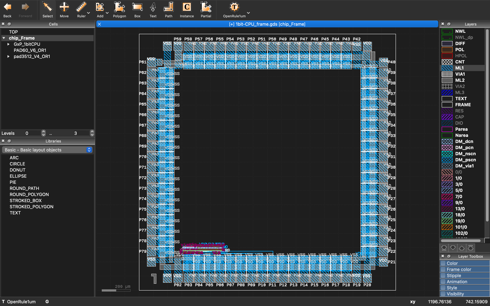

# 1bit CPU made with ASIC (ISHI-Kai's OpenMPW PTC06-1)
[naoto64氏の1bit-CPU](https://naoto64.github.io/1bit-CPU/)を[ISHI会版OpenMPW PTC06-1](https://ishi-kai.org/openmpw/shuttle/ptc06/2024/07/06/shuttle_ISHI-Kai_OpenMPW-PTC06-1_start.html)を利用して、ASIC化しました！  
サイズは、280um x 65um くらいとなりました。元の基板が85mm x 70mmですのでおよそ36万分の1に縮小できました！  

 
 
 

# 論理回路化
まずは、74HC series logic IC部分を論理回路に起こし直して、シミュレーションを行いました。  
シミュレーションには[logicsim](http://www.cburch.com/logisim/)を利用しています。  

 

## 各種回路
本家のサンプル回路をシミュレーションしました。  

-[LED点滅回路](logicsim/LED_brink.circ)
 
-[LED点灯回路](logicsim/LED_flash.circ)
 
-[NOP回路](logicsim/NOP.circ)
 

# AISC化
ここから、ASICにするための設計を行なっていきます。  

## 回路図
まずは、回路図を書きます。とは言っても、シミュレーション時に回路としては完成しているので、それをxschemで書き直しただけです。  

-[回路図](xschem/1bit-CPU.sch)
 

## レイアウト
続いて、論理回路のレイアウトをします。  
論理回路は実際には、P-FETやN-FETを組み合わせて機能が実現されています。  

 

もちろん、P-FETやN-FETを組み合わせて、自分で論理回路のレイアウトをしても良いのですが、通常スタセル（スタンダードセル）という物が用意されています。  
要は、P-FETやN-FETを組み合わせて作られている論理回路ライブラリです。3つ目が拡大図でP-FETとN-FETで構成されているのが確認できるかと思います。  

 
 
 

回路図そのままで、スタセルを配置してみたパターンです。  

 

### 一列化
このまま配線するだけでも良いのですが、通常のスタセルはVerilogなどから自動的にレイアウトに変換する時に使用するように作成されています。  
そのため、スタセルは自動レイアウトを考慮して、下の図のように縦の長さが固定されて、上部にVDDがあり下部にVSS(GND)があるタイル状の形状をしています。これらを横に並べて利用することで、VSSやVSSが接続されて、自動ルーティングや配置がしやすいように作られています。  

 

そのため、人間が見やすい回路図の形で配置し、配線すると無駄が多くなります。  
そこで、回路図をこのタイル型レイアウトに合わせて、一列に並ぶように書き換えます。  
（通常は、この手の論理回路で設計するロジック回路を手でレイアウトすることはあまり無いと思いますので、今回は結構特殊なシチュエーションとなります。）  

-[1ライン化回路図](xschem/1bit-CPU_1line.sch)
 
 
 

### 最終レイアウト
一列化して、配線したレイアウトです。  

-[レイアウト](klayout/1bit-CPU.gds)
 

## LVS
手配線のため回路図とレイアウトが間違っている可能性があるため、LVS（Layout vs Schematic）をかけるのですが、OpenRule1umのスタセルの作りが微妙のため、完全体とはなりませんでした。  
そのため、目LVSで乗り切りました。とは言っても、接続先は下の図（LVSの配線ハイライト）のように強調表示されるためそれほど大変ではありません。  

 
 

## パッドへの接続
最後に、実際の半導体上のパッド（ピン）に各ポートを接続します。  
本来ならピンの設定（INやOUT、デジタルかアナログかなどを指定する）があるのですが、そこの設定はNDAの範囲内での設定となるため、ここでは行いません。そのため、これは実質的に仮配線となります。  

 

-[パッド付きレイアウト](klayout/1bit-CPU_frame.gds)
 
 

# 動作用ボード
クロック源とROMとRESETボタンは内蔵していないため、外付けで用意する必要があります。  
そのため、それらに加え、電源や各種動作確認用のLEDも付けた基板を設計する予定です。  

 

## 動作確認
来年の１月に到着予定なので、動作用の基板を作って、 その時を待つのみです！
